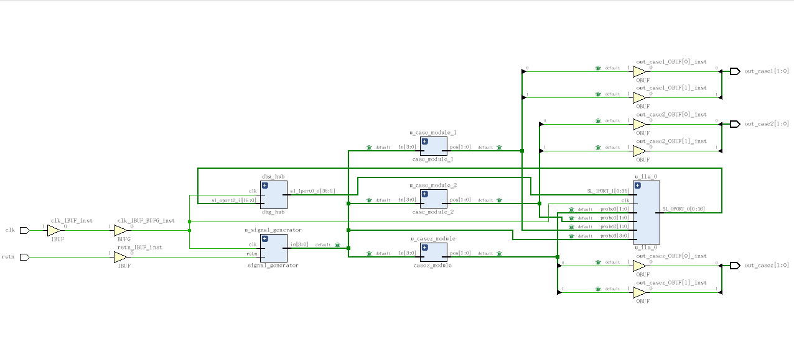
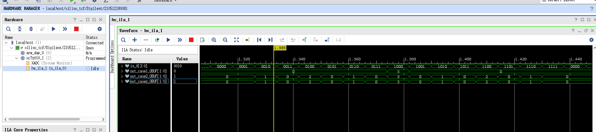
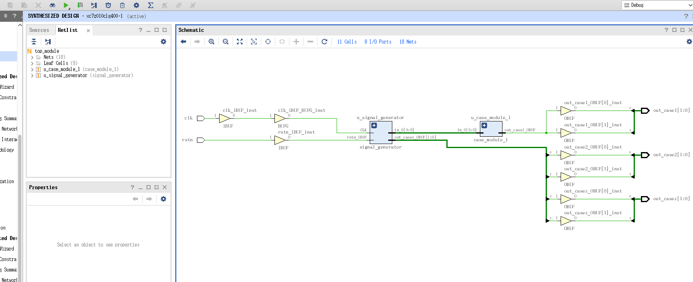
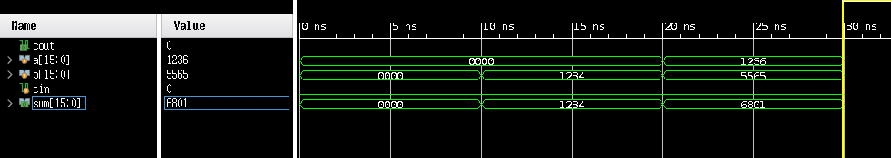

## Verilog语法

### case、casez、casex

首先确定一点，以上三种语句在vivado2018.3&ZYNQ7000的环境下，都是**可综合的**。但是x和z这两种电平是现实中不会出现的，所以在case语句中综合工具会直接将包还x或者z的分支直接忽略。

casez和casex的功能相似，下文只使用casez为例子：

#### 例子：4位优先编码器

优先编码器记录第一个1bit在数据中的位置，如4‘b1110编码后为2'b01。

首先是一个**错误**案例: 使用case语句，尝试用x表示未知量。

```verilog
module case_module_1 (
           input wire [3:0] in,
           output reg [1:0]  pos
       );

always @(*) begin
    case(in)
        4'bxxx1:
            pos = 2'd0;
        4'bxx10:
            pos = 2'd1;
        4'bx100:
            pos = 2'd2;
        4'b1000:
            pos = 2'd3;
        default :
            pos = 2'd0;
    endcase
end

endmodule //case_module_1
```

然后是一个使用case的正确案例：

假如入in[3:0] == 4‘b1111，那么四个分支都符合情况，但是生效的只有第一个分支。也就是说综合工具会保证最后综合得到的逻辑与代码逻辑相同。

所以在使用这个形式编写代码时，分支的先后顺序至关重要，代码逻辑的变化会导致综合结果变化。

```verilog
module case_module_2 (
           input wire [3:0] in,
           output reg [1:0]  pos
       );

always @(*) begin
    case(1'b1)
        in[0]:
            pos = 2'd0;
        in[1]:
            pos = 2'd1;
        in[2]:
            pos = 2'd2;
        in[3]:
            pos = 2'd3;
        default :
            pos = 2'd0;
    endcase
end

endmodule //case_module_2
```

然后是一个使用casez的案例：

在casez语句中，z表示任意匹配也就是无关，在使用下文的写法时，即使语句顺序颠倒也不会导致逻辑错误。

```verilog
module casez_module (
           input wire [3:0] in,
           output reg [1:0]  pos
       );

always @(*) begin
    casez(in)
        4'bzzz1:
            pos = 2'd0;
        4'bzz10:
            pos = 2'd1;
        4'bz100:
            pos = 2'd2;
        4'b1000:
            pos = 2'd3;
        default :
            pos = 2'd0;
    endcase
end
endmodule
```

编写顶层模块测试代码：

```verilog
module top_module(
           input  wire clk,
           input  wire rstn,

           output  wire [1:0] out_case1,
           output  wire [1:0] out_case2,
           output  wire [1:0] out_casez
       );

wire [3:0] in;
signal_generator  u_signal_generator (
                      .clk                     ( clk         ),
                      .rstn                    ( rstn        ),

                      .in                     ( in   [3:0] )
                  );

case_module_1 u_case_module_1(
                  .in                      ( in   [3:0] ),
                  .pos                     ( out_case1  [1:0] )
              );

case_module_2 u_case_module_2(
                  .in                      ( in   [3:0] ),
                  .pos                     ( out_case2  [1:0] )
              );

casez_module u_casez_module(
                 .in                      ( in   [3:0] ),
                 .pos                     ( out_casez  [1:0] )
             );

endmodule

module signal_generator(
           input clk,
           input rstn,
           output reg [3:0] in
       );

reg [2:0]count;
always @(posedge clk or negedge rstn) begin
    if (rstn == 1'b0) begin
        in <= 4'd0;
        count <= 3'd0;
    end
    else begin
        count <= count + 5'd1;
        if(count == 3'b111)
            in <= in + 4'd1;
        else
            in <= in ;
    end
end
endmodule
```

为了证明casez是可综合的，采用开发板验证：





可以看到第一种错误的case写法综合得到的结果中，都被匹配到了default:pos=2‘d0 


在去掉调试电路后的综合结果如下：



可以看到case2和casez甚至是使用相同的信号的，也就是说这两种写法的综合结果完全一致。

### 实例数组 instance array

实例数组可以一次性例化多个模块（module），其IO的连线可以为多个模块公用一个（如clk）,也可以每个模块都分别有自己的端口。

#### 例子：

```verilog
bcd_fadd u_bcd_fadd[99:0](
             a[399:0],
             b[399:0],
             intermediate_cin[99:0],
             intermediate_cout[99:0],
             sum[399:0]
         ); 

module bcd_fadd (
           input [3:0] a,
           input [3:0] b,
           input     cin,
           output reg  cout,
           output reg [3:0] sum );
```

此处将模块bcd_fadd例化了100份，并且每一个端口都分配单独的wire

#### 例题：

https://hdlbits.01xz.net/wiki/Bcdadd100

 参考上题，先准备一个1位BCD加法器：

```verilog
module bcd_fadd (
           input [3:0] a,
           input [3:0] b,
           input     cin,
           output reg  cout,
           output reg [3:0] sum );

always @(*) begin
    if(a+b+cin>4'd9) begin
        cout = 1'b1;
        sum = a+b+cin-4'd10;
    end
    else begin
        cout = 1'b0;
        sum = a+b+cin;
    end
end

endmodule
```

将多个1位BCD加法器串联可以得到串行多位BCD加法器。

接下来制作一个4位BCD加法器。

1. 串行4位加法器应当将上一个模块的cout连接到下一个模块的cout；

2. 第一个模块的cin连接上层模块的cin

3. 最后一个模块的cout连接上层模块的cout

```verilog
module top_module(
           input [15:0] a, b,
           input cin,
           output cout,
           output [15:0] sum );

wire [4:0] carry;

bcd_fadd u_bcd_fadd[3:0](
             a[15:0],
             b[15:0],
             carry[3:0],
             carry[4:1],
             sum[15:0]
         );

assign carry[0] = cin;
assign cout = carry[4];
endmodule
```

1. carry[0]对应的是第一个模块的cin

2. carry[4]对应的是最后一个模块的cout

3. carry[N]，N=1,2,3 则分别代表第N个模块的cout和第N+1个模块cin直接的连线

得到的原理图如下


上面代码还能稍作优化，可以使用拼接操作符{... , ...} 组合carry[] 与cin或者cout，免去额外的assign，代码如下：

```verilog
module top_module(
           input [15:0] a, b,
           input cin,
           output cout,
           output [15:0] sum );

wire [3:1] carry;

bcd_fadd u_bcd_fadd[3:0](
             .a     (   a[15:0] ),
             .b     (   b[15:0] ),
             .cin   (   { carry[3:1],cin }    ),
             .cout  (   { cout,carry[3:1] }   ),
             .sum   (   sum[15:0]   )
         );
endmodule
```

carry[N]，N=1,2,3 则分别代表第N个模块的cout和第N+1个模块cin直接的连线。原理图不发生变化。

仿真结果如下。



、
