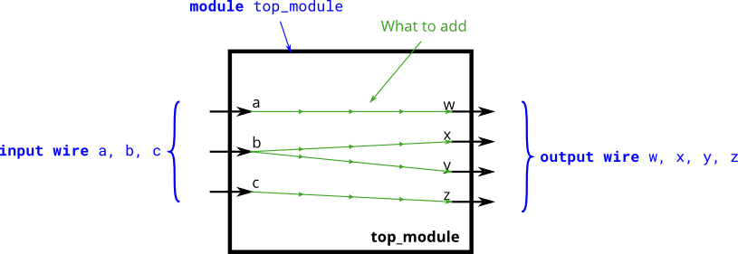

[HDLBits](https://hdlbits.01xz.net/wiki/Main_Page)

# Basics

## 2.Four wires

Create a module with 3 inputs and 4 outputs that behaves like wires that makes these connections:

a -> w
b -> x
b -> y
c -> z



```verilog
module top_module( 
    input a,b,c,
    output w,x,y,z );
    assign  {w,x,y,z} = {a,b,b,c};
endmodule
```

## 3. Notgate

实现一个非门

```verilog
module top_module( input in, output out );
    assign out = ~in;
endmodule
```

## 4.Andgate

实现一个与门


